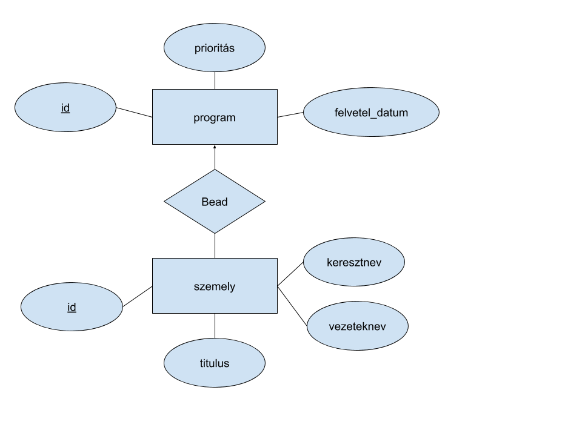

# Lyukkártyás programok nyilvántartása

Régen a hallgatók lyukkártyára írták a programjaikat, aztán ezt odaadták egy operátornak, aki lefuttatta azokat a tanszéki számítógépen.  
A projekt célja egy olyan alkalmazás kivitelezése, amellyel az operátor könnyen kezelheti a neki feldolgozásra átadott programokat.

# Specifikáció
## Feladat informális leírása
Egy lyukkártyás programokat nyilvántartó adatbázist szeretnék megvalósítani. Az adatbázisban szerepelni fognak a feldolgozandó programok, illetve az azokat megíró személyek. A cél ezen adatbázis karbantartása, ahol az operátor beviheti, ellenőrizheti, és törölheti az általa feldolgozandó programok adatait.

## Elérhető funkciók

Az alkalmazás a következő funkciókat biztosítja:
 * Programok kezelése:
    * Új program létrehozása
    * Meglévő program adatainak módosítása
    * Programok törlése
    * Az adatbázisban tárolt programok listázása
    * Programok keresése: szűrés prioritás, tulajdonos, illetve felvétel dátuma alapján
    * Programok hozzárendelése más felhasználóhoz
* Személyek kezelése:
    * Új személyek létrehozása
    * Meglévő személyek adatainak módosítása
    * Személyek törlése
    * Az adatbázisban tárolt személyek listázása
## Adatbázis séma
Az adatbázisban a következő entitások és attribútumok szerepelnek:
 * Program: azonosító, prioritás, felvétel dátuma
 * Személy: azonosító, vezetéknév, keresztnév, titulus

A fenti adatok tárolására az alábbi séma szolgál:

 
